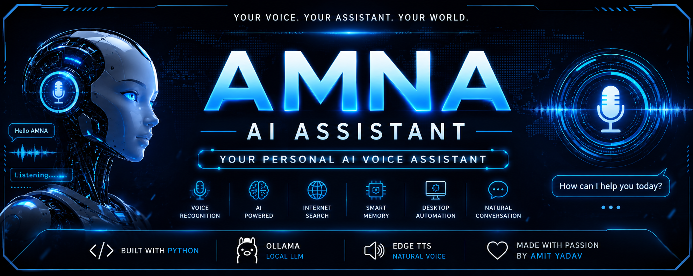

<p align="center">
  
</p>

<p align="center">
  
</p>

<h1 align="center">🤖 AMNA AI Assistant</h1>

<p align="center">
<b>Your Personal AI Voice Assistant</b>
</p>

<p align="center">
Built with ❤️ using Python • Ollama • Edge TTS • Speech Recognition
</p>

<p align="center">
  
  
  
  
  
</p>

---

# 🚀 About AMNA

AMNA is an AI-powered personal voice assistant developed by **Amit Yadav**.

It understands voice commands, responds naturally, remembers conversations, searches the web, automates desktop tasks, and runs locally using Ollama.

The vision of AMNA is to become a fully featured desktop AI assistant similar to Jarvis, ChatGPT Voice, Google Assistant, and Alexa while keeping user data private.

---

# ✨ Features

- 🎤 Voice Recognition
- 🗣️ Natural AI Voice (Edge TTS)
- 🤖 Local AI Chat (Ollama)
- 🌐 Internet Search
- 📚 Wikipedia Search
- ☁️ Weather Information
- 🧠 Long-Term Memory
- 💻 Desktop Automation
- 📂 Open Applications
- 🌍 Open Websites
- 🇮🇳 English + Hindi + Hinglish Support
- ⏹️ Stop Speaking Anytime
- ⚡ Fast Speech Response

---

# 🛠️ Tech Stack

- Python 3.12
- Ollama
- Edge TTS
- SpeechRecognition
- Keyboard
- Pygame
- Requests
- BeautifulSoup4
- Wikipedia API

---

# 📂 Project Structure

```text
AMNA/
│
├── assistant/
│   ├── apps.py
│   ├── brain.py
│   ├── internet.py
│   ├── llm.py
│   ├── memory.py
│   ├── speak.py
│   ├── speech.py
│   ├── tools.py
│   └── weather.py
│
├── data/
│   └── memory.json
│
├── images/
│   ├── banner.png
│   ├── logo.png
│   ├── demo1.png
│   └── demo2.png
│
├── voice_mode.py
├── main.py
├── requirements.txt
├── LICENSE
├── README.md
└── .gitignore
```

---

# 🎙️ Example Commands

```text
Hello AMNA

Who created you?

Open Chrome

Open YouTube

Search Python tutorials

Remember my name

What's today's weather?

Who is Elon Musk?

Stop speaking
```

---

# 🚀 Installation

## Clone Repository

```bash
git clone https://github.com/amityadav757330/AMNA-AI-Assistant.git
```

## Open Project

```bash
cd AMNA-AI-Assistant
```

## Install Requirements

```bash
pip install -r requirements.txt
```

## Install Ollama

Download:

https://ollama.com/download

Pull a model

```bash
ollama pull qwen2.5:1.5b
```

or

```bash
ollama pull llama3.2
```

Start Ollama

```bash
ollama serve
```

Run AMNA

```bash
python voice_mode.py
```

---

# 📸 Screenshots

## Logo

<p align="center">

</p>

## Voice Assistant

Coming Soon...

---

# 🎥 Demo

Coming Soon...

A full demonstration GIF will be added after the Continuous Conversation feature is completed.

---

# 🗺️ Roadmap

## ✅ Completed

- Voice Recognition
- AI Chat
- Local LLM
- Memory
- Desktop Automation
- Internet Search
- Wikipedia
- Weather
- Natural Voice

## 🚧 In Progress

- Continuous Conversation
- Wake Word ("Hey AMNA")
- Better Memory
- Faster Responses

## 🔮 Planned

- Camera Vision
- Face Recognition
- Object Detection
- OCR
- PDF Reader
- WhatsApp Automation
- Email Automation
- Calendar
- Reminders
- AI Image Generation
- Desktop GUI
- Mobile Companion App

---

# 💻 System Requirements

- Windows 10 / 11
- Python 3.12+
- Ollama
- Microphone
- Speaker
- Internet Connection (for online features)

---

# 🤝 Contributing

Contributions are welcome.

1. Fork this repository

2. Create a feature branch

```bash
git checkout -b feature-name
```

3. Commit your changes

```bash
git commit -m "Added new feature"
```

4. Push

```bash
git push origin feature-name
```

5. Create a Pull Request

---

# 👨‍💻 Developer

## Amit Yadav

B.Tech Computer Science Engineering

GL Bajaj Institute of Technology & Management

### Interests

- Artificial Intelligence
- Python Development
- Automation
- Machine Learning
- Software Engineering

GitHub

https://github.com/amityadav757330

---

# 📄 License

This project is licensed under the MIT License.

See the LICENSE file for details.

---

<p align="center">

⭐ If you like this project, don't forget to Star the repository.

Made with ❤️ by Amit Yadav

</p>